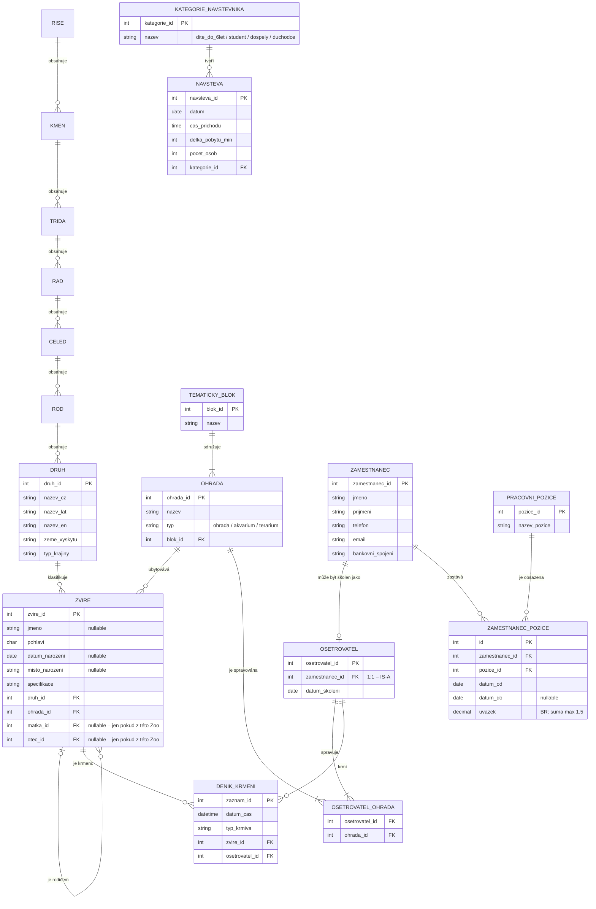

```mermaid
erDiagram
    RISE ||--o{ KMEN : "obsahuje"
    KMEN ||--o{ TRIDA : "obsahuje"
    TRIDA ||--o{ RAD : "obsahuje"
    RAD ||--o{ CELED : "obsahuje"
    CELED ||--o{ ROD : "obsahuje"
    ROD ||--o{ DRUH : "obsahuje"

    DRUH {
        int druh_id PK
        string nazev_cz
        string nazev_lat
        string nazev_en
        string zeme_vyskytu
        string typ_krajiny
    }

    ZVIRE {
        int zvire_id PK
        string jmeno "nullable"
        char pohlavi
        date datum_narozeni "nullable"
        string misto_narozeni "nullable"
        string specifikace
        int druh_id FK
        int ohrada_id FK
        int matka_id FK "nullable – jen pokud z této Zoo"
        int otec_id FK "nullable – jen pokud z této Zoo"
    }

    DRUH ||--o{ ZVIRE : "klasifikuje"
    ZVIRE |o--o{ ZVIRE : "je rodičem"

    TEMATICKY_BLOK {
        int blok_id PK
        string nazev
    }

    OHRADA {
        int ohrada_id PK
        string nazev
        string typ "ohrada / akvarium / terarium"
        int blok_id FK
    }

    TEMATICKY_BLOK ||--|{ OHRADA : "sdružuje"
    OHRADA ||--o{ ZVIRE : "ubytovává"

    ZAMESTNANEC {
        int zamestnanec_id PK
        string jmeno
        string prijmeni
        string telefon
        string email
        string bankovni_spojeni
    }

    OSETROVATEL {
        int osetrovatel_id PK
        int zamestnanec_id FK "1:1 – IS-A"
        date datum_skoleni
    }

    ZAMESTNANEC ||--o| OSETROVATEL : "může být školen jako"

    PRACOVNI_POZICE {
        int pozice_id PK
        string nazev_pozice
    }

    ZAMESTNANEC_POZICE {
        int id PK
        int zamestnanec_id FK
        int pozice_id FK
        date datum_od
        date datum_do "nullable"
        decimal uvazek "BR: suma max 1.5"
    }

    ZAMESTNANEC ||--o{ ZAMESTNANEC_POZICE : "zastává"
    PRACOVNI_POZICE ||--o{ ZAMESTNANEC_POZICE : "je obsazena"

    OSETROVATEL_OHRADA {
        int osetrovatel_id FK
        int ohrada_id FK
    }

    OSETROVATEL ||--|{ OSETROVATEL_OHRADA : "spravuje"
    OHRADA ||--|{ OSETROVATEL_OHRADA : "je spravována"

    DENIK_KRMENI {
        int zaznam_id PK
        datetime datum_cas
        string typ_krmiva
        int zvire_id FK
        int osetrovatel_id FK
    }

    ZVIRE ||--o{ DENIK_KRMENI : "je krmeno"
    OSETROVATEL ||--o{ DENIK_KRMENI : "krmí"

    KATEGORIE_NAVSTEVNIKA {
        int kategorie_id PK
        string nazev "dite_do_6let / student / dospely / duchodce"
    }

    NAVSTEVA {
        int navsteva_id PK
        date datum
        time cas_prichodu
        int delka_pobytu_min
        int pocet_osob
        int kategorie_id FK
    }

    KATEGORIE_NAVSTEVNIKA ||--o{ NAVSTEVA : "tvoří"
```
